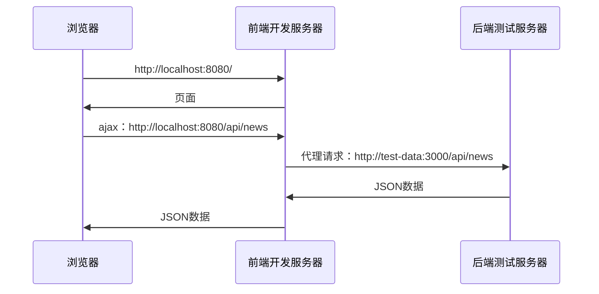
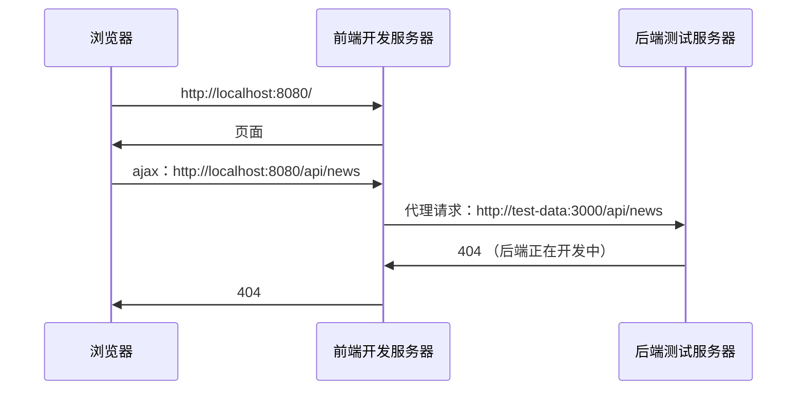
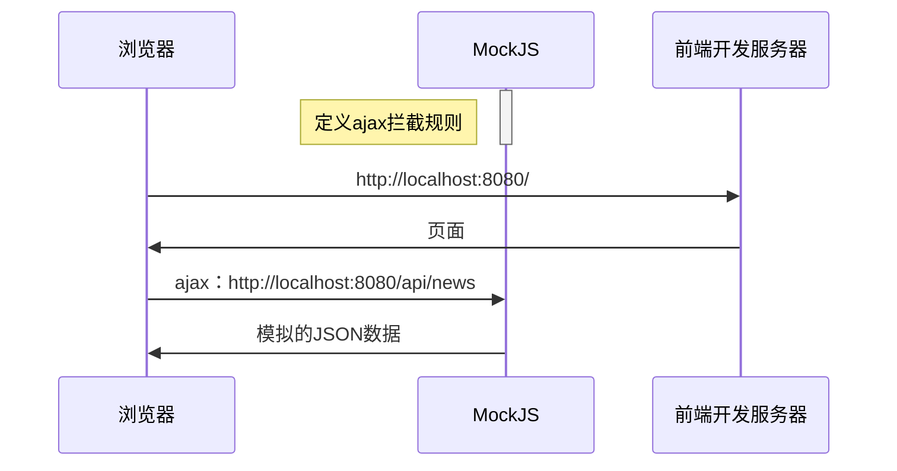

### 获取远程数据

**远程数据获取和Vue没有半毛钱关系**

> vue cli: https://cli.vuejs.org/zh/

> axios: https://github.com/axios/axios

> mockjs：http://mockjs.com/

> 开发环境有跨域问题

> 生产环境没有跨域问题

**解决开发环境的跨域问题**

跨域只存在于浏览器当中、我们的数据请求会返回、但是被浏览器所拦截了。

解决跨域就是我们中间设置一个代理、让我们数据请求是请求开发服务器、而不是后端服务器、这样请求开发服务器就不存在跨域问题了、然后开发服务器代理道后端服务器就解决了跨域问题




#### 代理实现
```js
// vue.config.js
module.exports = {
  devServer : {
    Proxy : {
      "/api" : {
         target : "http://test.my-site.com"
      }
    }
  }
}

// request.js
import showMessage from "@/utils/showMessage";
import axios from "axios";
// import showMessage from "@/utils/showMessage";

// 创建一个axios实例
const ins = axios.create();

// 使用实例来监听数据
// 请求过来的数据都会执行下面方法
ins.interceptors.response.use(function(resp){
    if( resp.data.code !== 0 ){
        showMessage({
            content : resp.data.msg,
            type : "error",
            duration : 1500,
        })
        return null;
    } 
    return resp.data.data;
})
export default ins;

// banner.js
import request from "./request" 
export default async function getBanners(){
    return await request.get("/api/banner")
}

// App.vue
import banner from "@/api/banner"
  methods : {
      async getAjax(){
        // console.log("请求", api)
        const data = await banner();
        console.log(data);
      }
  }
```

### 为什么要Mock数据

MockJS是起到AJAX拦截功能、当后端服务器正在开发的时候我们可以使用mockjs来拦截、然后返回虚拟数据给我们这边测试、等待后端服务器开发完成则可以使用后端开发的数据。





#### 模拟数据实现
```js
// banner.js
import Mock from "mockjs"

Mock.mock("/api/banner", "get", {
    code : 0, // 0是无错误  406:验证失败  500:服务器内部的未知错误
    msg: "",
    data: [
        { },
        { },
        { },
    ],
})

// main.js 引入
import "./mock";
```
